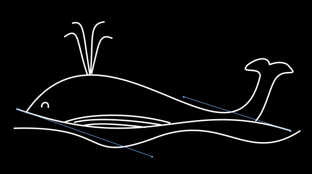

# Cairo Test
An old Xcode test project of mine from many years ago. The code was written in Objective-C and use the [Cairo graphics library](https://cairographics.org). The app run natively on macOS (Mac OS X 10.6 when I created this project.)

### How to use the app
- Left-click and drag to enter drawing mode.
- Right-click to end drawing mode.
- Click on any existing curve to select and enter edit mode.
- Use delete key to remove the selected curve.

### The First Whale
A screenshot of a whale illustration I made using the app built from this project.

